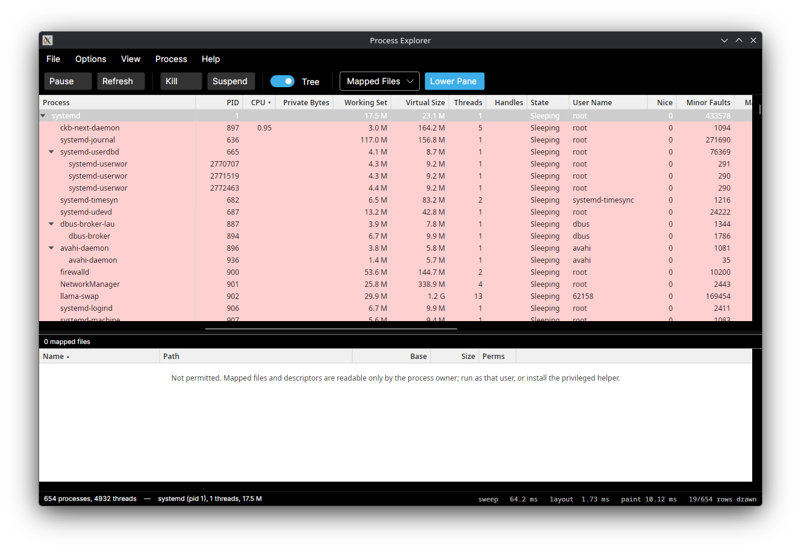

# Sysinternals Process Explorer for Linux

A Linux implementation of the core Process Explorer experience, written in C# on .NET 10 with an
Avalonia UI front end. It is a sibling to
[ProcexpForMac](https://github.com/microsoft/ProcexpForMac) and follows the same architecture:
immutable snapshots produced by pluggable providers behind narrow interfaces, with the UI depending
only on those interfaces.

This is a **re-implementation, not a source port** — no Swift is shared. What carries over is the
architecture, the data contracts, and the feature set.

## Install

```sh
curl -fsSL https://raw.githubusercontent.com/craig-b/ProcexpForLinux/main/Scripts/get.sh | sh
```

Picks the release tarball matching the machine's architecture and libc, verifies its checksum, and
installs. Works on x86_64 and aarch64, glibc (Arch, Debian, Ubuntu, Fedora, …) and musl (Alpine).
The optional privileged helper is offered interactively and never enabled silently — see
[docs/HELPER.md](docs/HELPER.md). Uninstall later with
`sudo bash /usr/share/procexp/install.sh --uninstall`.

## Status

Working. The process tree, lower pane, Properties window, System Information window, find dialog and
settings all function; the data layer is verified against the live kernel on every run of the smoke
checker.

Not yet done: per-process network rates (Linux exposes no counter — see `Procexp.Net`), GPU memory
on most DRM drivers, and Flatpak/AppImage packaging.

Process icons are deliberately absent rather than pending. Linux has no per-executable icon API:
icons belong to applications via `.desktop` entries, so only the handful of GUI processes would ever
resolve one and every daemon, shell and kernel thread would show the same generic glyph. The row
colours already carry the categorical signal icons carry on macOS.

## Screenshot

Process tree with the frozen name pane, independently scrolling metric columns, and the Process
Explorer row colours — pink for systemd services, blue for your own processes. Description, Company
and Verified Signer come from the distribution package database, filled in behind the sweep rather
than blocking it.



## Layout

| Project                   | Role                                                                                                                  |
| ------------------------- | --------------------------------------------------------------------------------------------------------------------- |
| `src/Procexp.Model`       | Shared contracts: `ProcessRecord`, `ProcessSnapshot`, provider interfaces, colouring rules. No platform dependencies. |
| `src/Procexp.Sampling`    | The unprivileged sampling engine. Parses `/proc` directly.                                                            |
| `src/Procexp.SystemStats` | System-wide CPU/memory/disk/network stats and hardware detail.                                                        |
| `src/Procexp.Net`         | Per-process sockets via netlink `sock_diag`, with a `/proc/net` fallback.                                             |
| `src/Procexp.Provenance`  | The Linux analog of code signing — package ownership, build-id, IMA, VirusTotal.                                      |
| `src/Procexp.Autostart`   | systemd units, XDG autostart, cron, init.d.                                                                           |
| `src/Procexp.Actions`     | Kill, suspend/resume, renice, restart, sample.                                                                        |
| `src/Procexp.Gpu`         | Per-process GPU usage from DRM `fdinfo` and NVML.                                                                     |
| `src/Procexp.Privileged`  | Client for the privileged helper.                                                                                     |
| `src/Procexp.Helper`      | The privileged helper daemon (`procexp-helper`).                                                                      |
| `src/Procexp.Smoke`       | Headless smoke-checker for the data layer (`procexp-smoke`).                                                          |
| `src/Procexp.App`         | The Avalonia GUI (`procexp`).                                                                                         |

## Requirements

- .NET 10 SDK and a C toolchain (`clang`) to build; released binaries are natively compiled and need
  no .NET runtime at all
- A Linux kernel exposing `/proc` (no `hidepid` restriction for full fidelity)

## Build and run

```sh
dotnet build ProcexpLinux.slnx
dotnet run --project src/Procexp.App
```

Prove the data layer against the live kernel, without a GUI:

```sh
dotnet run --project src/Procexp.Smoke
```

Release binaries — Native AOT, no runtime dependency:

```sh
./Scripts/build-release.sh
sudo ./Scripts/install.sh # optional; offers to activate the helper, never silently
```

|                  | Size   | Startup |
| ---------------- | ------ | ------- |
| `procexp`        | 25 MB  | —       |
| `procexp-helper` | 3.6 MB | 3 ms    |
| `procexp-smoke`  | 5.5 MB | 3 ms    |

See [docs/RELEASE.md](docs/RELEASE.md) for the measurements behind that choice.

## Distributions

Tested on Arch, Debian 13, Ubuntu 24.04, Fedora and Alpine, against all four package managers. The
glibc binary runs unmodified on the first four; Alpine needs a musl build, which
`Scripts/build-musl.sh` produces.

Service classification requires systemd; everything else is init-agnostic. See
[docs/DISTROS.md](docs/DISTROS.md).

## What needs privilege

Most of `/proc` is world-readable, so the app runs unprivileged and shows the full process tree,
command lines, and complete per-thread detail for every process — the last of which macOS cannot do
without a task port.

Six per-process files are gated by `ptrace_may_access` and readable only by the owning user: `maps`,
`fd`, `fdinfo`, `io`, `smaps_rollup` and `environ`. Without the optional privileged helper, the
corresponding columns and lower-pane views are blank for other users' processes, and say so rather
than showing zero.

The helper is optional and **not** enabled by packaging. Membership of its access group lets a user
read any process's environment, so enabling it is a deliberate administrative decision — see
[docs/HELPER.md](docs/HELPER.md).

## Notes on the port

macOS data sources map onto `/proc` almost one-for-one, and several things get _easier_:
`/proc/PID/cmdline` is world-readable (the macOS version needs a privileged helper for other users'
argv), and per-thread detail comes from `/proc/PID/task/*/stat` without the task-port dance. See
[docs/PORTING_NOTES.md](docs/PORTING_NOTES.md).

The two areas with no clean equivalent are code signing — replaced by package provenance, see
`Procexp.Provenance` — and the custom table implementation, see
[docs/UI_TABLE_NOTES.md](docs/UI_TABLE_NOTES.md).
